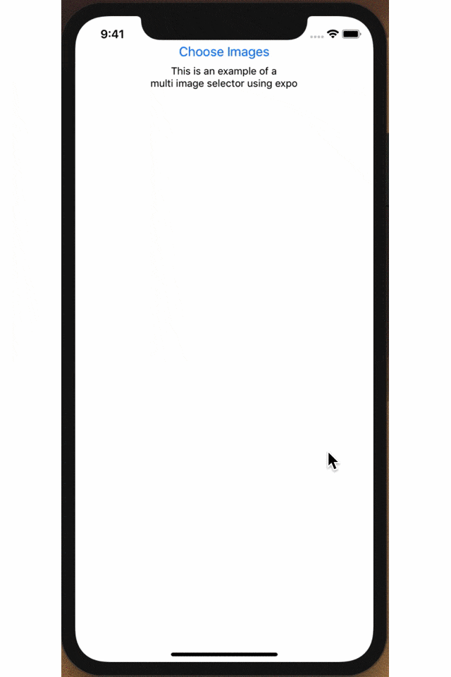

[](https://badge.fury.io/js/expo-multiple-media-imagepicker)

# expo-multiple-media-imagepicker

Multiple image selecting package for React Native using Expo MediaLibrary.

## features
- Pick multiple images
- Displays the selected image counter on picking images
- Get [Asset Information](https://docs.expo.io/versions/latest/sdk/media-library/#asset) when after pick images.



## usage
1. Install the repository
    ```bash
    $ npm install --save expo-multiple-media-imagepicker
    ```
    or
    ```bash
    $ yarn add expo-multiple-media-imagepicker
    ```
2. Add an import to the top of your file
    ```js
    import { ImageBrowser } from 'expo-multiple-media-imagepicker';
    ```
3. Declare the component in the render method.
    ```js
    <ImageBrowser
        max={101} // Maximum number of pickable image. default is None
        headerCloseText={'キャンセル'} // Close button text on header. default is 'Close'.
        headerDoneText={'　　完了'} // Done button text on header. default is 'Done'.
        headerButtonColor={'#E31676'} // Button color on header.
        headerSelectText={'枚の画像を選択中'} // Word when picking.  default is 'n selected'.
        mediaSubtype={'screenshot'} // Only iOS, Filter by MediaSubtype. default is display all.
        badgeColor={'#E31676'} // Badge color when picking.
        emptyText={'選択できる画像がありません'} // Empty Text
        callback={this.imageBrowserCallback} // Callback functinon on press Done or Cancel Button. Argument is Asset Infomartion of the picked images wrapping by the Promise. />
    ```
